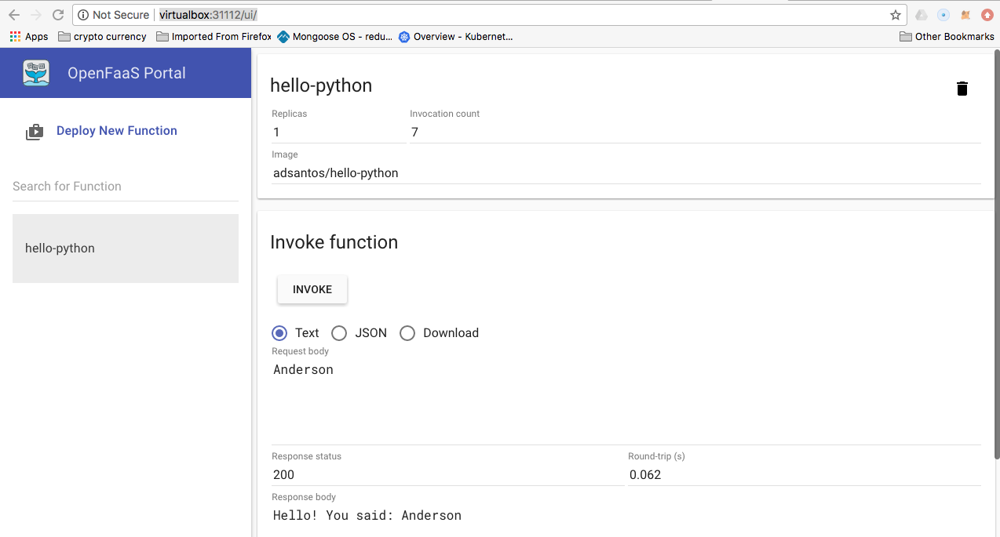

# Deploy

```bash
anderson@mac-as:openfaas$ faas build -f ./hello-python.yml
[0] > Building: hello-python.
Clearing temporary build folder: ./build/hello-python/
Preparing ./hello-python/ ./build/hello-python/function
Building: adsantos/hello-python with python template. Please wait..
Sending build context to Docker daemon  7.168kB
Step 1/16 : FROM python:2.7-alpine
 ---> 64905abbb69e
Step 2/16 : RUN apk --no-cache add curl     && echo "Pulling watchdog binary from Github."     && curl -sSL https://github.com/openfaas/faas/releases/download/0.6.9/fwatchdog > /usr/bin/fwatchdog     && chmod +x /usr/bin/fwatchdog     && apk del curl --no-cache
 ---> Using cache
 ---> a31f40d0d1be
Step 3/16 : WORKDIR /root/
 ---> Using cache
 ---> ee8b49ef561e
Step 4/16 : COPY index.py           .
 ---> Using cache
 ---> 851a214e804f
Step 5/16 : COPY requirements.txt   .
 ---> Using cache
 ---> 629b0b406a72
Step 6/16 : RUN pip install -r requirements.txt
 ---> Using cache
 ---> 3db766f5871d
Step 7/16 : RUN mkdir -p function
 ---> Using cache
 ---> 94a007a647c4
Step 8/16 : RUN touch ./function/__init__.py
 ---> Using cache
 ---> e7452223efe5
Step 9/16 : WORKDIR /root/function/
 ---> Using cache
 ---> 768c2a9e21be
Step 10/16 : COPY function/requirements.txt	.
 ---> Using cache
 ---> 4fa10d370871
Step 11/16 : RUN pip install -r requirements.txt
 ---> Using cache
 ---> 070f99c45a8b
Step 12/16 : WORKDIR /root/
 ---> Using cache
 ---> 8020c688a291
Step 13/16 : COPY function           function
 ---> Using cache
 ---> caa4547b4bdf
Step 14/16 : ENV fprocess="python index.py"
 ---> Using cache
 ---> b80d2f9b1b66
Step 15/16 : HEALTHCHECK --interval=1s CMD [ -e /tmp/.lock ] || exit 1
 ---> Using cache
 ---> 12da9bcd2ffd
Step 16/16 : CMD ["fwatchdog"]
 ---> Using cache
 ---> 153b2f6d6f71
Successfully built 153b2f6d6f71
Successfully tagged adsantos/hello-python:latest
Image: adsantos/hello-python built.
[0] < Builder done.

anderson@mac-as:openfaas$ faas push -f ./hello-python.yml
[0] > Pushing: hello-python.
The push refers to repository [docker.io/adsantos/hello-python]
da6102264ab1: Pushed
d12570911867: Pushed
310400b8b214: Pushed
d46972969757: Pushed
12de77f0d8ff: Pushed
19ad1c5282b9: Pushed
4a858ca9581f: Pushed
d5fde5b67719: Pushed
837ac7382d51: Pushed
b1dc8ab0e170: Mounted from library/python
c5130c42f015: Mounted from library/python

anderson@mac-as:openfaas$ faas deploy -f ./hello-python.yml
Deploying: hello-python.
No existing function to remove
Deployed.
URL: http://virtualbox:31112/function/hello-python

202 Accepted

```

# Verify

```bash
anderson@mac-as:openfaas$ docker images | grep hello-python
hello-python                   latest              153b2f6d6f71        52 seconds ago      84MB

anderson@mac-as:openfaas$ faas list -g http://virtualbox:31112
Function                      	Invocations    	Replicas
hello-python                  	0              	1
```


# Run

```bash
anderson@mac-as:openfaas$ faas invoke hello-python -g http://virtualbox:31112
Reading from STDIN - hit (Control + D) to stop.
Anderson
Hello! You said: Anderson

anderson@mac-as:openfaas$ curl virtualbox:31112/function/hello-python -d "it's Anderson here"
Hello! You said: it's Anderson here

anderson@mac-as:openfaas$ echo Anderson | faas invoke hello-python -g http://virtualbox:31112
Hello! You said: Anderson
```

## UI

Open UI [http://virtualbox:31112/ui/](http://virtualbox:31112/ui/)



# Referências
1. https://blog.alexellis.io/first-faas-python-function/